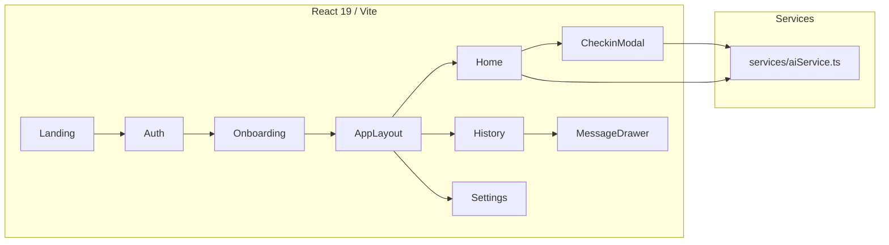

# Trait Flow AI Studio UI 仕様書（v2.0 フロントエンド）

## 0. 背景
- `trait_flow_screen_UI` として AI Studio で構築したモバイル向け UI を GitHub の `trait-flow-mvp2.0` リポジトリへ取り込み、日本語 UI として整備した。
- 目的は **Big Five × 日次チェックイン × AI メッセージ** の価値を、バックエンドが未完成な段階でも検証できるプロトタイピング基盤を提供すること。
- 主要ターゲットは日本語ユーザー（iOS/Android モバイルブラウザ）。Gemini API 連携は `services/aiService.ts` のモックを差し替えるだけで移行できる構成を採用。

## 1. 検証仮説と成功指標
- **検証仮説**
  1. 完全日本語化されたオンボーディングと UI により、TIPI 診断の離脱率を 20% 以下に抑えられる。
  2. Big Five スコアと直近チェックインを使った AI メッセージは、テンプレートのみの定型文よりも「役に立つ」と評価される。
  3. Gemini API（もしくは他 LLM）を 1 リクエスト/日ペースで呼び出しても、ブラウザ単体で 5 秒以内にメッセージを提示できる。
- **成功指標（ローンチ 2 週間）**
  - ローンチ翌週のオンボーディング完了率 ≥ 80%。
  - 日次チェックイン投稿者のうち 60% が 5 回以上レーティングを付与。
  - 「今日のメッセージが役立った」評価（5 段階の 4 以上） ≥ 65%。
  - Gemini API 呼び出し成功率 ≥ 97%、レスポンス中央値 < 5 秒。

## 2. スコープ
### 実装済み機能
- **ランディング & 認証プロンプト**：メール入力とパイロット参加 CTA を備えたヒーローセクション、マジックリンク型ログインの疑似画面。
- **TIPI オンボーディング**：10 問を 2 ページで出題、7 段階スライダーで回答、平均化して特性スコアを算出しレーダーチャートに表示。
- **ホーム / 今日のメッセージ**：あいさつ、AI 生成メッセージ、5 段階スター評価 UI、日次チェックイン CTA。
- **チェックインモーダル**：気分スライダー（1〜5）、エネルギーレベル 3 つ、メモ（任意）、送信後に AI メッセージを生成。
- **履歴画面**：チェックインタブとメッセージタブを切り替え、メッセージの詳細ドロワーも提供。
- **設定画面**：アカウント情報、通知設定トグル、データ管理ショートカット、ログアウトボタンをモックで表示。
- **開発者ナビ**：全画面へジャンプできるフローティングボタン（QA/デモ用途）。
- **Docker / Cloud Run 対応**：Vite ビルド → Nginx 配信 → `start.sh` で `PORT` を環境変数から挿入。

### スコープ外（今後）
- 今回の UI には永続化・Supabase 連携・実際のメール送信は含まれない。
- Push 通知 / PWA インストール / 多言語サポート。
- メトリクス管理画面、A/B テスト、Symanto API 等の高度な分析。

## 3. ユーザーフロー
1. **ランディング**：パイロット案内 → メール入力 → 「参加を申し込む」で `/auth` へ遷移。
2. **擬似ログイン**：メール入力 → マジックリンク送付を疑似表示 → 2 秒後にオンボーディングへ。
3. **TIPI オンボーディング**：ようこそ画面 → ページングしながら 10 問回答 → スコア結果を確認 → ホームへ遷移。
4. **ホーム**：
   - 「今日のメッセージ」を閲覧し、スターで評価。
   - 「今日のチェックイン」カードからモーダルを開く。
   - チェックイン完了後は新しい AI メッセージがモーダル内に表示される。
5. **履歴**：チェックイン / メッセージを切り替え、メッセージ詳細をドロワーで閲覧。
6. **設定**：通知トグルやデータエクスポートなどの操作感を確認（現時点ではスタブ）。

### 3.1 アーキテクチャ（React 単体構成）

## 4. 機能仕様（UI モジュール）
- **UI-A: ランディング (`LandingPage`)**
  - メール入力（`useState` で保持）と CTA ボタン。
  - 主要価値訴求のリスト（FeatureListItem）3 つを表示。
  - Tailwind CDN（`index.html`）ベースのグラデーション背景。
- **UI-B: 認証モック (`AuthPage`)**
  - メール入力、マジックリンク送信ボタン、送信中状態（2 秒後に `/app/onboarding`）。
  - バックナビ（`aria-label="前の画面に戻る"`）。
- **UI-C: オンボーディング (`OnboardingPage`)**
  - ステップ `welcome → quiz → result` を `useState` で管理。
  - `TIPI_QUESTIONS`（2 ページ × 5 問）を範囲スライダーで入力、ページごとに進捗バーを更新。
  - スコア算出ロジック：反転項目は `8 - answer`、特性ごとに平均化。結果画面では `BigFiveRadarChart` とリスト解説。
- **UI-D: ホーム (`HomePage`)**
  - あいさつテキスト、`getPersonalizedMessage` で取得した当日メッセージ表示。
  - スター評価 UI（現状はクリック時の状態保存なし、UI 表現のみ）。
  - チェックイン CTA → `CheckinModal` を開く。`mockUserScores` と最新チェックインで AI メッセージを再生成。
- **UI-E: チェックインモーダル (`CheckinModal`)**
  - 気分スライダー、エネルギーボタン 3 種、任意メモ。
  - 送信で `onSave` を呼び出し、`result` 状態では生成メッセージを提示し「閉じる」ボタンを表示。
- **UI-F: 履歴 (`HistoryPage` + `MessageDetailDrawer`)**
  - タブ切替（チェックイン / メッセージ）。
  - 各カードに日付、気分、エネルギー、メモを表示。
  - 「詳細を見る」でドロワーを右側からスライド表示し、基準特性・気分・エネルギーを確認。
- **UI-G: 設定 (`SettingsPage`)**
  - アカウント情報表示、通知設定トグル（CSS のみで動作）、データ管理ボタン、ログアウトボタンをモック実装。
- **UI-H: レイアウト (`AppLayout`, `AppHeader`, `BottomNav`, `DevNav`)**
  - HashRouter + `<Outlet>` 構成。`/app/onboarding` ではヘッダー/ボトムナビを非表示。
  - `DevNav` ボタンで任意の画面へジャンプ。
- **Service-S: AI メッセージ (`services/aiService.ts`)**
  - 現状は Promise で 800ms 遅延後、Big Five の最上位特性に紐づく定型文を返す。
  - 将来的に Gemini などの LLM 呼び出しへ差し替え。`PersonalizedMessage` 形式（`id`, `date`, `text`, `personalizationInfo`）で返却する。

## 5. データモデル / 型
| 型 | 説明 |
| --- | --- |
| `BigFiveTrait` | `"Extraversion" | "Agreeableness" | …` の列挙。`BIG_FIVE_TRAIT_LABELS` で日本語ラベルに変換。 |
| `BigFiveScores` | キーを `BigFiveTrait` とする数値マップ（0〜7）。`mockUserScores` でサンプル値を保持。 |
| `TIPIQuestion` | `{ id, text, trait, isReversed }`。`constants.ts` で日本語文面を管理。 |
| `Checkin` | `{ id, date, mood:1-5, energy:'low'|'medium'|'high', note? }`。`mockCheckinHistory` でダミーデータ。 |
| `PersonalizedMessage` | `{ id, date, text, rating?, personalizationInfo:{ baseTrait, mood, energy } }`。 |

現状はすべてフロントエンドメモリ上で扱い、永続化は未実装。将来的に API へ送る際もこの型をそのまま利用する想定。

## 6. 外部サービス / 依存
- **LLM**：現時点ではスタブだが、`services/aiService.ts` を Gemini API へ差し替えることで本番化できる。必要な入力は Big Five スコアと直近チェックイン。
- **Tailwind CDN**：`index.html` で `https://cdn.tailwindcss.com` を読み込み、テーマカラーをカスタム。
- **アイコン**：ヒーロー・ナビの SVG はローカルに定義。外部アセット依存なし。
- **ビルド/配信**：Node.js 18+ / Vite 6 / React 19。Dockerfile は `node:20-alpine` → `nginx:1.27-alpine` の 2 ステージ。

## 7. 非機能要件
- **パフォーマンス**：モバイル端末でも 60fps を維持できる軽量 UI（ページごとのコンポーネント分割、必要最小限の状態）。
- **アクセシビリティ**：主要ボタンに `aria-label` を設定。テキストは全て日本語。
- **ビルド/テスト**：`npm run build` で 30ms 程度。ユニットテストは未整備（今後 Vite + Vitest を導入予定）。
- **デプロイ**：Cloud Run で `PORT` を渡すだけで起動。`start.sh` が `envsubst` で Nginx 設定を書き換える。

## 8. ロードマップ（想定 6 週）
1. **Week 1**: Gemini API 接続、`.env` 管理、LLM 応答エラーハンドリング。
2. **Week 2**: Supabase（または Firebase）とのセッション/データ保存を実装。
3. **Week 3**: メッセージ評価やチェックイン履歴を API と同期。Analytics（GA4 or Supabase Insights）導入。
4. **Week 4**: 通知設定トグルをバックエンドへ連携、メール/LINE/Push リマインダーの PoC。
5. **Week 5**: QA（iOS/Android） & ローカリゼーション微調整、UI ポリッシュ。
6. **Week 6**: クローズドパイロット（5〜10 名）開始、定性フィードバック収集。

## 9. リスクとフォロー
- **データ未保存**：現状は全てモックのため、ユーザーが入力した内容はリロードで消える → バックエンド接続までにストレージ戦略（Supabase or LocalStorage）を決定。
- **LLM レイテンシ**：API 遅延時のローディング表示はあるが、タイムアウトやリトライは未実装 → `AbortController` とフォールバック文の導入が必要。
- **多端末テスト不足**：レスポンシブ設計はモバイル最適化だが、タブレット/PC の QA が未実施 → Tailwind ブレークポイントの検証が必要。
- **セキュリティ**：現行はフロントエンドのみで、API キーをブラウザに持たせられない → 本番前にサーバー側プロキシを必須とする。

## 10. 参考資料
- `trait-flow-mvp/docs/prototype_spec_ja.md`（初期仕様書）
- `trait-flow-mvp2.0/README.md`（実行・デプロイ手順）
- `trait-flow-mvp2.0/App.tsx`, `components/`, `services/aiService.ts`（主要ロジック）
- Google TIPI (Gosling et al. 2003)
- Google Cloud Run / Vite / React Router 公式ドキュメント
